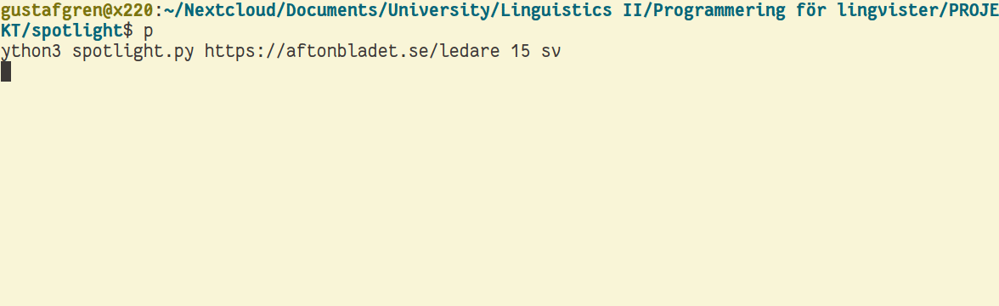

# Spotlight



Simple web crawler and topic extractor written in Python, using `requests` for 
HTML-requests, `lda` for topic extraction, `BeautifulSoup` for HTML parsing,
and `spacy` for lemmatization.

## Requirements

`requests`, `lda`, `spacy`, `numpy`, `bs4` installed through for example `pip`. The following corpora for `spacy`: `en_core_web_sm` and `sv_core_news_sm`

All of which (including this repo) can be downloaded using the following commands:

```
pip3 install requests lda spacy numpy bs4
python3 -m spacy download en_core_web_sm
python3 -m spacy download sv_core_news_sm
git clone https://github.com/skogsgren/spotlight.git
```

## Typical usage

The syntax for usage is `python3 spotlight.py URL COUNT LANG OPTION`, where 
`URL` is replaced by the website you want it to crawl, `COUNT` by the number 
of articles you want it to crawl before stopping (larger number gives better
results), `LANG` by either 'en' for English or 'sv' for Swedish, and `OPTION`
being an optional flag (`--sloppy, --sloppytext,` or `--sloppylink`) which
tells the program to disregard CSS flag during extraction of text and links
respectively.

Output will be written to a txt-file with the base URL as filename (e.g. 
'theguardian.txt' for the example given above), as well as the same output 
being given in the terminal. Example output for the command
`python3 spotlight.py https://aftonbladet.se/ledare 1500 sv`:

```
crawled 1501 pages on https://aftonbladet.se/ledare
TOPICS:
Topic 0: finnas barn komma samhälle rätt ställe länge
Topic 1: Sverige hålla säga ändå fall därför komma
Topic 2: skola ekonomisk pengar skatt välfärd värld sänka
Topic 3: människa person egen vecka politisk gång våld
Topic 4: jobb företag betala pengar svensk krona arbetsmarknad
Topic 5: direkt Aftonbladet Facebook medi skriva bild tidning
Topic 6: säga stor Stockholm vård pandemin region annan
Topic 7: land finnas stor annan visa komma Sverige
Topic 8: politik regering fråga politisk parti hålla säga
Topic 9: Ryssland president Ukraina rysk Lindberg riksdag makt
```

and `python3 spotlight.py https://theguardian.com/profile/editorial 3000 en`:

```
crawled 3001 pages on https://www.theguardian.com/profile/editorial
TOPICS:
Topic 0: health pandemic government minister England public week
Topic 1: country political election economic voter party politic
Topic 2: century book moment write once history London
Topic 3: election democracy most power party political president
Topic 4: Brexit minister Britain Boris Johnson party Theresa
Topic 5: most human such important show example form
Topic 6: long week already case seem happen clear
Topic 7: government decade money company income high market
Topic 8: president Trump international China country Donald military
Topic 9: report police case abuse government court public
```

and `python3 spotlight.py https://www.friatider.se/opinion 1500 sv`:

```
crawled 1501 pages on https://friatider.se/opinion
TOPICS:
Topic 0: Sverige demokrati politisk term invandring publicera försöka
Topic 1: politik olik föra Sverige stor politisk svensk
Topic 2: finnas svensk anse rösta demokratisk tala fråga
Topic 3: direkt exempel krona tillgång gratis Plus innehåll
Topic 4: positiv person därför artikel stark olik använda
Topic 5: Sverige kräva antal finnas säga stor fråga
Topic 6: annan politik person ofta svensk stor mången
Topic 7: istället kalla varför visa problem situation politisk
Topic 8: finnas annan egen verka person skriva människa
Topic 9: person skapa åsikt viss amerikansk Sverige ligga
```
